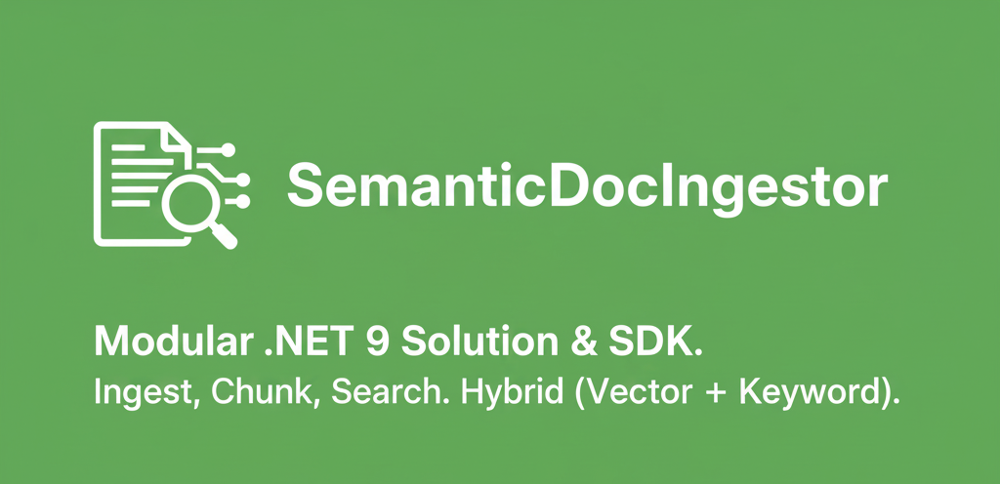

# SemanticDocIngestor

[](https://github.com/raminesfahani/SemanticDocIngestor/actions/workflows/nuget-packages.yml)
[](LICENSE)
[](https://github.com/raminesfahani/SemanticDocIngestor/search?l=c%23)

[](https://www.nuget.org/packages/SemanticDocIngestor.Core)



SemanticDocIngestor is a modular .NET 9 solution and SDK for ingesting, chunking, and searching documents with hybrid search (vector + keyword). It includes a Blazor Server UI, API service, and full support for .NET Aspire.

---

## Key features

- .NET Aspire ready (local orchestration and cloud-ready)
- Blazor Server UI for interactive ingestion and search
- Document ingestion pipeline
  - Robust chunking with deterministic IDs and de-duplication
  - Hybrid storage: keyword (Elasticsearch) + vector store (Qdrant)
  - Resilient bulk upserts with cleanup of previous versions
- Multi-source ingestion
  - Local files
  - OneDrive (Microsoft Graph)
  - Google Drive (Drive API)
- Hybrid search
  - Vector similarity + keyword search with optional reranking
- SDK-first design
  - Clean abstractions for processors, stores, and services
- Middleware & observability
  - Polly-based resiliency (timeouts/retries/circuit breakers), Serilog logging
- Optional integrations
  - Ollama for LLM usage
  - MongoDB for chat history and caching

---

## Solution layout

```
SemanticDocIngestor/
├── src/
│   ├── apps/
│   │   ├── SemanticDocIngestor.AppHost.AppHost            # .NET Aspire orchestration
│   │   ├── SemanticDocIngestor.AppHost.BlazorUI           # Blazor Server UI
│   │   └── SemanticDocIngestor.AppHost.ApiService         # API for ingestion/search
│   └── sdk/
│       ├── SemanticDocIngestor.Core                       # Core SDK and services
│       ├── SemanticDocIngestor.Infrastructure             # Integrations (Elastic, Qdrant, resolvers)
│       └── SemanticDocIngestor.Domain                     # Abstractions & domain models
└── tests/
    └── SemanticDocIngestor.AppHost.Tests                  # Tests
```

---

## Prerequisites

- .NET 9 SDK
- Elasticsearch (keyword search)
- Qdrant (vector search)
- Optional: Ollama, MongoDB
- Optional (cloud ingestion): Microsoft Entra ID app + Google OAuth app

---

## Configure

- Elasticsearch and Qdrant connection strings in appsettings (API/Infrastructure).
- For cloud sources:
  - Microsoft (OneDrive): AzureAd (Instance, Domain, TenantId, ClientId, ClientSecret, CallbackPath), scope `Files.Read`.
  - Google (Drive): Google (ClientId, ClientSecret) with scope `https://www.googleapis.com/auth/drive.readonly`.
- The SDK ensures the Elastic index exists and treats missing-index deletes as best-effort on first run.

---

## Build & run

- Build: `dotnet build`
- Run with Aspire: start `SemanticDocIngestor.AppHost.AppHost`.
- Or run individually: start `SemanticDocIngestor.AppHost.ApiService` and `SemanticDocIngestor.AppHost.BlazorUI`.

---

## Ingest documents

Inputs can be local paths or cloud identifiers/links:

- Local: `C:\docs\report.pdf`
- OneDrive: `onedrive://{driveId}/{itemId}` or share links (1drv.ms/sharepoint.com)
- Google Drive: `gdrive://{fileId}` or `https://drive.google.com/file/d/{fileId}/view`

Example (SDK):

```
var inputs = new[]
{
    @"C:\\docs\\example.pdf",
    "onedrive://<driveId>/<itemId>",
    "https://drive.google.com/file/d/<fileId>/view"
};
await _documentIngestor.IngestDocumentsAsync(inputs, maxChunkSize: 500, cancellationToken);
```

The pipeline stamps a stable identity per document (Source + FilePath). Cloud sources use URI identities (e.g., `onedrive://driveId/itemId`, `gdrive://fileId`) to ensure idempotent re-ingestion.

---

## Search

Perform hybrid search with optional reranking:

```
var results = await _documentIngestor.SearchDocumentsAsync(
    "quarterly revenue trend",
    limit: 10,
    reranker: null,
    cancellationToken);
```

---

## Notes

- Elastic index creation is handled by the SDK. Delete-by-query ignores missing index on early boot.
- Vector store uses Qdrant; configure endpoint and API key via connection string.
- Blazor app supports delegated user auth for OneDrive/Google to list and ingest user files.

---

## Contributing & support

- See [CONTRIBUTING.md](CONTRIBUTING.md) and [SUPPORT.md](SUPPORT.md).
- This project follows a [Code of Conduct](CODE_OF_CONDUCT.md).

Licensed under the MIT License.