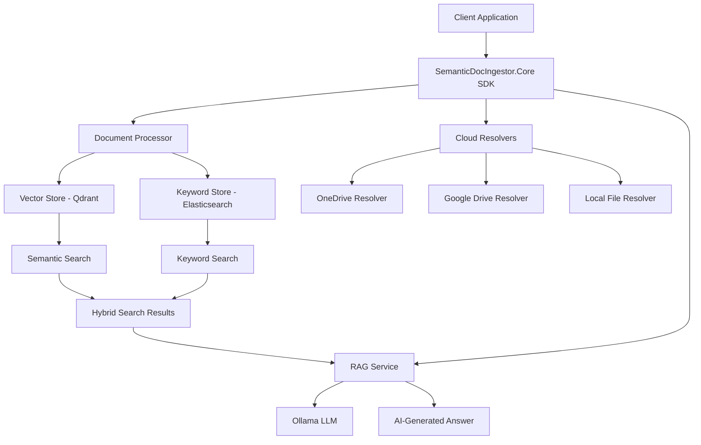

# SemanticDocIngestor

[](https://github.com/raminesfahani/SemanticDocIngestor/actions/workflows/nuget-packages.yml)
[](LICENSE)
[](https://github.com/raminesfahani/SemanticDocIngestor/search?l=c%23)

[](https://www.nuget.org/packages/SemanticDocIngestor.Core)
[](https://dotnet.microsoft.com/download/dotnet/9.0)

<p align="center">
  
</p>

<p align="center">
  <strong>A powerful .NET 9 SDK for intelligent document processing with hybrid search and RAG capabilities</strong>
</p>

<p align="center">
  Build production-ready document ingestion pipelines with vector similarity search, keyword matching, and AI-powered answers using Ollama LLMs
</p>

---

## 🎯 Overview

**SemanticDocIngestor** is a comprehensive .NET 9 solution and SDK for ingesting, processing, and searching documents with state-of-the-art hybrid search capabilities. It combines vector similarity search (semantic) with traditional keyword search (BM25) to deliver optimal retrieval results for retrieval-augmented generation (RAG) applications.

### What Makes It Special?

- **🎨 SDK-First Design**: Clean, well-documented APIs with full IntelliSense support
- **🚀 .NET Aspire Ready**: First-class support for cloud-native orchestration with automatic service discovery
- **🔍 Hybrid Search**: Best-of-both-worlds combining vector embeddings and keyword matching
- **☁️ Multi-Source Support**: Ingest from local files, OneDrive, Google Drive, and more
- **🤖 AI-Powered**: Built-in RAG with Ollama for intelligent question answering
- **📊 Real-Time Progress**: Event-driven architecture with SignalR support
- **⚡ Production-Ready**: Resilient with Polly (retries, circuit breakers, timeouts)
- **🧩 Extensible**: Plugin architecture for custom processors and cloud providers

---

## 📦 Quick Start (NuGet Package)

### Installation

```bash
dotnet add package SemanticDocIngestor.Core
```

### Minimal Setup with .NET Aspire

```csharp
using SemanticDocIngestor.Core;

var builder = WebApplication.CreateBuilder(args);

// Add Aspire service defaults
builder.AddServiceDefaults();

// Add SemanticDocIngestor (auto-discovers Elasticsearch, Qdrant, Ollama)
builder.Services.AddSemanticDocIngestorCore(builder.Configuration);

var app = builder.Build();

var loggerFactory = app.Services.GetRequiredService<ILoggerFactory>();
app.UseSemanticDocIngestorCore(app.Configuration, loggerFactory);

app.MapDefaultEndpoints();
app.Run();
```

### Basic Usage

```csharp
// Inject the service
public class DocumentController(IDocumentIngestorService documentIngestor) : ControllerBase
{
    [HttpPost("ingest")]
    public async Task<IActionResult> Ingest([FromBody] List<string> filePaths)
    {
  await documentIngestor.IngestDocumentsAsync(filePaths);
        return Ok();
    }

  [HttpGet("search")]
    public async Task<IActionResult> Search([FromQuery] string query)
    {
        var response = await documentIngestor.SearchAndGetRagResponseAsync(query, limit: 5);
        return Ok(new { answer = response.Answer, sources = response.ReferencesPath.Keys });
    }
}
```

### 📖 Complete SDK Documentation

**👉 [Read the Full SDK Guide](src/sdk/SemanticDocIngestor.Core/README.md)** - Comprehensive documentation including:
- Detailed installation and configuration
- .NET Aspire integration guide
- Connection string management (Aspire and manual)
- Advanced features (multi-source ingestion, progress tracking)
- Complete API reference
- Real-world examples and deployment scenarios
- Troubleshooting and performance tips

---

## 🏗️ Solution Architecture

### Repository Structure

```
SemanticDocIngestor/
├── src/
│   ├── sdk/    # 📦 NuGet Packages
│   │   ├── SemanticDocIngestor.Core  # Main SDK (Published to NuGet)
│   │   │   └── README.md          # 📖 Complete SDK Documentation
│   │   ├── SemanticDocIngestor.Domain         # Domain models & abstractions
│   │   └── SemanticDocIngestor.Infrastructure # Implementations (Elastic, Qdrant, Ollama)
│   │
│   └── apps/# 🎯 Reference Applications
│       ├── SemanticDocIngestor.AppHost.AppHost        # .NET Aspire orchestration
│ ├── SemanticDocIngestor.AppHost.ApiService     # REST API service
│       ├── SemanticDocIngestor.AppHost.BlazorUI     # Interactive Blazor UI
│       └── SemanticDocIngestor.AppHost.ServiceDefaults # Aspire defaults
│
├── tests/
│   └── SemanticDocIngestor.AppHost.Tests      # Unit & integration tests
│
├── docs/            # Additional documentation
├── DOCUMENTATION_SUMMARY.md # SDK documentation checklist
├── CONTRIBUTING.md                    # Contribution guidelines
├── SUPPORT.md      # Support resources
└── CODE_OF_CONDUCT.md         # Community guidelines
```

### Core Components



---

## ✨ Key Features

### 📄 Document Processing Pipeline
- **Multi-Format Support**: PDF, DOCX, XLSX, PPTX, TXT, MD
- **Intelligent Chunking**: Configurable chunk sizes with context preservation
- **Metadata Extraction**: Page numbers, sections, sheet names, row indices
- **Deterministic IDs**: Prevents duplicate ingestion with stable identities
- **Batch Processing**: Efficient bulk operations with progress tracking

### 🔍 Hybrid Search Engine
- **Vector Search**: Semantic similarity using Qdrant and embedding models
- **Keyword Search**: Full-text search with Elasticsearch BM25 algorithm
- **Result Fusion**: Automatic deduplication and relevance ranking
- **Configurable Limits**: Control the number of results and context size

### ☁️ Multi-Source Ingestion
- **Local Files**: Direct file system access
- **OneDrive**: Microsoft Graph API integration with delegated auth
- **Google Drive**: Drive API v3 with OAuth 2.0 support
- **Extensible**: Plugin architecture for custom cloud providers (S3, Azure Blob, etc.)

### 🤖 Retrieval-Augmented Generation (RAG)
- **Ollama Integration**: Local LLM support (Llama 3, Mistral, Gemma, etc.)
- **Context Assembly**: Automatic context building from search results
- **Streaming Responses**: Real-time token-by-token answer generation
- **Source Attribution**: Track which documents contributed to answers

### 📊 Real-Time Progress Tracking
- **Event-Driven**: Subscribe to `OnProgress` and `OnCompleted` events
- **SignalR Support**: Real-time updates to web clients
- **Cached Progress**: Query progress at any time during ingestion
- **Detailed Metrics**: Files processed, completion percentage, current file

### ⚡ Production-Grade Resilience
- **Polly Integration**: Configurable retry policies, circuit breakers, timeouts
- **Graceful Degradation**: Continues processing on partial failures
- **Connection Pooling**: Efficient resource utilization
- **Health Checks**: Aspire-compatible health endpoints

### 🎨 Developer Experience
- **Full XML Documentation**: IntelliSense support for all public APIs
- **Clean Abstractions**: SOLID principles, dependency injection
- **Comprehensive Logging**: Structured logging with Serilog
- **OpenTelemetry Ready**: Distributed tracing and metrics
- **NuGet Package**: Simple installation and versioning

---

## 🚀 Getting Started

### Prerequisites

| Component | Version | Purpose | Optional |
|-----------|---------|---------|----------|
| .NET SDK | 9.0+ | Runtime | ❌ Required |
| Elasticsearch | 8.x | Keyword search | ❌ Required |
| Qdrant | 1.x | Vector search | ❌ Required |
| Ollama | Latest | LLM & embeddings | ✅ Optional (for RAG) |
| Docker Desktop | Latest | Container runtime | ✅ Recommended |

### Option 1: Using the SDK in Your Project

**Best for:** Integrating document search into existing applications

```bash
# Install the NuGet package
dotnet add package SemanticDocIngestor.Core

# Configure and use (see SDK README for details)
```

📖 **[Complete SDK Guide](src/sdk/SemanticDocIngestor.Core/README.md)**

### Option 2: Running the Reference Application

**Best for:** Exploring features, testing, or using as-is

#### With .NET Aspire (Recommended)

```bash
# Clone the repository
git clone https://github.com/raminesfahani/SemanticDocIngestor.git
cd SemanticDocIngestor

# Restore dependencies
dotnet restore

# Run with Aspire (starts all services)
cd src/apps/SemanticDocIngestor.AppHost
dotnet run

# Access the applications
# - Aspire Dashboard: http://localhost:15888
# - API Service: http://localhost:5000
# - Blazor UI: http://localhost:5001
```

#### Without Aspire

```bash
# Start infrastructure services
docker-compose up -d

# Run API service
cd src/apps/SemanticDocIngestor.AppHost.ApiService
dotnet run

# Run Blazor UI (in another terminal)
cd src/apps/SemanticDocIngestor.AppHost.BlazorUI
dotnet run
```

---

## 📖 Documentation

| Document | Description |
|----------|-------------|
| **[SDK Guide](src/sdk/SemanticDocIngestor.Core/README.md)** | Complete SDK documentation with examples, API reference, and deployment guides |
| **[Documentation Summary](DOCUMENTATION_SUMMARY.md)** | Overview of all documentation and packaging details |
| **[Contributing Guide](CONTRIBUTING.md)** | How to contribute to the project |
| **[Support](SUPPORT.md)** | Getting help and support resources |
| **[Code of Conduct](CODE_OF_CONDUCT.md)** | Community guidelines |

---

## 🎯 Usage Examples

### Ingesting Documents

```csharp
// Local files
var localFiles = new[] { @"C:\docs\report.pdf", @"C:\docs\data.xlsx" };
await documentIngestor.IngestDocumentsAsync(localFiles);

// OneDrive files
var oneDriveFiles = new[] 
{ 
    "onedrive://{driveId}/{itemId}",
    "https://1drv.ms/u/s!xxxxxxxxxxxxxx" 
};
await documentIngestor.IngestDocumentsAsync(oneDriveFiles);

// Google Drive files
var driveFiles = new[] 
{ 
    "gdrive://{fileId}",
  "https://drive.google.com/file/d/{fileId}/view" 
};
await documentIngestor.IngestDocumentsAsync(driveFiles);

// Mixed sources
var mixedSources = new[]
{
    @"C:\local\file.pdf",
    "onedrive://drive123/item456",
    "gdrive://abc123def456"
};
await documentIngestor.IngestDocumentsAsync(mixedSources);
```

### Searching Documents

```csharp
// Simple hybrid search
var results = await documentIngestor.SearchDocumentsAsync(
  "quarterly revenue trends",
    limit: 10);

foreach (var chunk in results)
{
    Console.WriteLine($"File: {chunk.Metadata.FileName}");
    Console.WriteLine($"Content: {chunk.Content}");
    Console.WriteLine($"Page: {chunk.Metadata.PageNumber}");
}
```

### AI-Powered Question Answering

```csharp
// Get an AI-generated answer with sources
var response = await documentIngestor.SearchAndGetRagResponseAsync(
    "What were the key findings in the Q4 report?",
    limit: 5);

Console.WriteLine($"Answer: {response.Answer}");
Console.WriteLine("\nSources:");
foreach (var source in response.ReferencesPath.Keys)
{
    Console.WriteLine($"  - {source}");
}
```

### Streaming Responses

```csharp
// Stream the answer token-by-token
var streamingResponse = await documentIngestor.SearchAndGetRagStreamResponseAsync(
    "Summarize the main points",
 limit: 5);

await foreach (var token in streamingResponse.Answer)
{
    Console.Write(token.Message.Content);
}
```

### Progress Tracking

```csharp
// Subscribe to events
documentIngestor.OnProgress += (sender, progress) =>
{
    Console.WriteLine($"Progress: {progress.Completed}/{progress.Total} - {progress.FilePath}");
};

documentIngestor.OnCompleted += (sender, progress) =>
{
    Console.WriteLine($"Completed! Processed {progress.Total} documents");
};

// Or query progress
var progress = await documentIngestor.GetProgressAsync();
Console.WriteLine($"{progress.Completed} of {progress.Total} files processed");
```

---

## 🔧 Configuration

### Minimal Configuration (with .NET Aspire)

```json
{
  "AppSettings": {
    "Ollama": {
 "ChatModel": "llama3.2",
  "EmbeddingModel": "nomic-embed-text",
      "Temperature": 0.7,
      "MaxTokens": 2048
    },
    "Qdrant": {
      "CollectionName": "documents",
      "VectorSize": 768,
      "Distance": "Cosine"
    },
    "Elastic": {
      "SemanticDocIndexName": "semantic_docs",
      "DocRepoIndexName": "docs_repo"
    }
  }
}
```

### Full Configuration (without Aspire)

```json
{
  "ConnectionStrings": {
    "elasticsearch": "http://localhost:9200",
    "qdrant": "http://localhost:6333",
 "ollama": "http://localhost:11434"
  },
  "AppSettings": {
    "Ollama": {
      "ChatModel": "llama3.2",
      "EmbeddingModel": "nomic-embed-text",
      "Temperature": 0.7,
      "MaxTokens": 2048
    },
    "Qdrant": {
      "CollectionName": "documents",
      "VectorSize": 768,
      "Distance": "Cosine"
    },
    "Elastic": {
      "SemanticDocIndexName": "semantic_docs",
      "DocRepoIndexName": "docs_repo"
    }
  },
"ResiliencyMiddlewareOptions": {
    "RetryCount": 3,
    "TimeoutSeconds": 30,
    "ExceptionsAllowedBeforeCircuitBreaking": 5,
    "CircuitBreakingDurationSeconds": 60
  }
}
```

**📖 See the [SDK Guide](src/sdk/SemanticDocIngestor.Core/README.md) for complete configuration details**

---

## 🏗️ Architecture & Design

### Document Processing Pipeline

1. **Input Resolution**: Local paths or cloud URIs are resolved to local file paths
2. **Document Parsing**: Files are parsed and text is extracted with metadata
3. **Chunking**: Content is split into manageable chunks with overlap
4. **Embedding Generation**: Chunks are converted to vector embeddings via Ollama
5. **Dual Storage**: Chunks are stored in both Qdrant (vectors) and Elasticsearch (keywords)
6. **Deduplication**: Deterministic IDs prevent duplicate chunks

### Hybrid Search Flow

1. **Parallel Search**: Query runs against both vector store and keyword store simultaneously
2. **Result Merging**: Results from both stores are deduplicated and combined
3. **Relevance Ranking**: Combined results are ranked by relevance scores
4. **Context Assembly**: Top results are assembled for RAG context
5. **Answer Generation**: Ollama generates an answer based on retrieved context

### Extensibility Points

- **`IDocumentProcessor`**: Add support for custom file formats
- **`ICloudFileResolver`**: Integrate additional cloud storage providers
- **`IVectorStore`**: Use alternative vector databases (Pinecone, Weaviate, etc.)
- **`IElasticStore`**: Replace or extend keyword search implementation
- **`IRagService`**: Customize LLM interactions and prompt engineering

---

## 📊 Supported File Formats

| Format | Extension | Features Extracted |
|--------|-----------|-------------------|
| PDF | `.pdf` | Text, page numbers, metadata |
| Word | `.docx` | Text, sections, formatting |
| Excel | `.xlsx` | Cell data, sheet names, row indices |
| PowerPoint | `.pptx` | Slide content, speaker notes |
| Text | `.txt`, `.md` | Raw text content |

---

## 🌐 Deployment Options

### Local Development
- Use .NET Aspire for orchestration
- Docker Compose for infrastructure
- Development-specific connection strings

### Docker
- Containerized API and UI
- Infrastructure in Docker Compose
- Environment-based configuration

### Kubernetes
- Helm charts for deployment
- ConfigMaps and Secrets for configuration
- Horizontal pod autoscaling

### Azure Container Apps
- Deploy with `azd up` (Azure Developer CLI)
- Aspire automatic resource provisioning
- Managed identity for secrets

### Traditional Hosting
- IIS, Kestrel, or Nginx
- Connection strings via appsettings or Key Vault
- Manual infrastructure management

**📖 See the [SDK Guide](src/sdk/SemanticDocIngestor.Core/README.md) for detailed deployment instructions**

---

## 🧪 Testing

```bash
# Run all tests
dotnet test

# Run with coverage
dotnet test --collect:"XPlat Code Coverage"

# Run specific test project
dotnet test tests/SemanticDocIngestor.AppHost.Tests
```

---

## 🤝 Contributing

We welcome contributions! Here's how you can help:

1. **Report Bugs**: [Open an issue](https://github.com/raminesfahani/SemanticDocIngestor/issues/new?template=bug_report.md)
2. **Request Features**: [Open a feature request](https://github.com/raminesfahani/SemanticDocIngestor/issues/new?template=feature_request.md)
3. **Submit PRs**: Read our [Contributing Guide](CONTRIBUTING.md)
4. **Improve Docs**: Documentation PRs are always welcome
5. **Share Examples**: Show us what you've built!

### Development Setup

```bash
# Fork and clone the repository
git clone https://github.com/YOUR_USERNAME/SemanticDocIngestor.git
cd SemanticDocIngestor

# Create a feature branch
git checkout -b feature/amazing-feature

# Make your changes and test
dotnet build
dotnet test

# Submit a pull request
```

---

## 📜 License

This project is licensed under the **MIT License** - see the [LICENSE](LICENSE) file for details.

---

## 🙏 Acknowledgments

Built with these amazing technologies:

- **[.NET Aspire](https://learn.microsoft.com/dotnet/aspire/)** - Cloud-ready app stack for .NET
- **[Qdrant](https://qdrant.tech/)** - High-performance vector database
- **[Elasticsearch](https://www.elastic.co/)** - Distributed search and analytics engine
- **[Ollama](https://ollama.ai/)** - Run large language models locally
- **[Polly](https://github.com/App-vNext/Polly)** - .NET resilience and transient-fault-handling library
- **[AutoMapper](https://automapper.org/)** - Convention-based object-object mapper
- **[Serilog](https://serilog.net/)** - Flexible, structured logging

Special thanks to all [contributors](https://github.com/raminesfahani/SemanticDocIngestor/graphs/contributors) who have helped make this project better!

---

## 📞 Support & Community

- **📖 Documentation**: [SDK Guide](src/sdk/SemanticDocIngestor.Core/README.md) | [Documentation Summary](DOCUMENTATION_SUMMARY.md)
- **🐛 Bug Reports**: [GitHub Issues](https://github.com/raminesfahani/SemanticDocIngestor/issues)
- **💬 Discussions**: [GitHub Discussions](https://github.com/raminesfahani/SemanticDocIngestor/discussions)
- **❓ Questions**: [Stack Overflow](https://stackoverflow.com/questions/tagged/semanticdocingestor)
- **📧 Email**: [Support](SUPPORT.md)

---

## 🗺️ Roadmap

### v1.x (Current)
- ✅ Core SDK with hybrid search
- ✅ Multi-source ingestion (local, OneDrive, Google Drive)
- ✅ RAG with Ollama
- ✅ .NET Aspire support
- ✅ Comprehensive documentation

### v2.x (Planned)
- ⬜ Additional file formats (HTML, RTF, CSV)
- ⬜ Advanced chunking strategies (semantic, sliding window)
- ⬜ Custom reranking models
- ⬜ Azure Blob Storage resolver
- ⬜ AWS S3 resolver
- ⬜ Multi-language support
- ⬜ Document versioning
- ⬜ Distributed ingestion

### Future
- ⬜ Fine-tuning support
- ⬜ Advanced RAG techniques (HyDE, RAG-Fusion)
- ⬜ GraphQL API
- ⬜ gRPC support
- ⬜ Mobile SDKs

**Vote on features or suggest new ones in [Discussions](https://github.com/raminesfahani/SemanticDocIngestor/discussions)!**

---

## 📈 Stats


---

<p align="center">
  <strong>Made with ❤️ by <a href="https://github.com/raminesfahani">Ramin Esfahani</a></strong>
</p>

<p align="center">
  If you find this project useful, please consider giving it a ⭐️
</p>