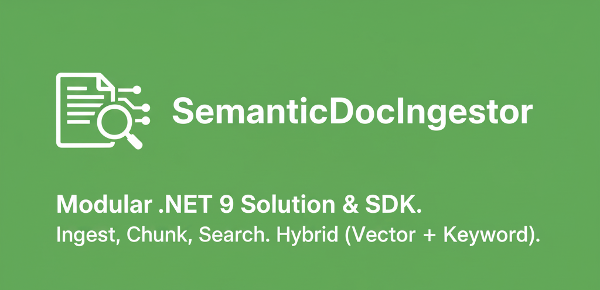
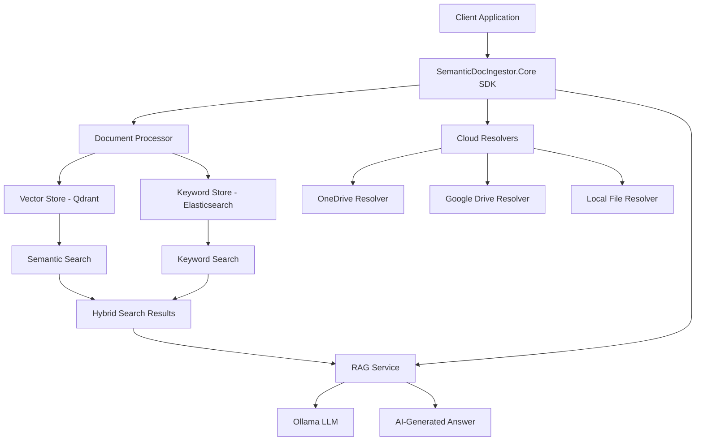
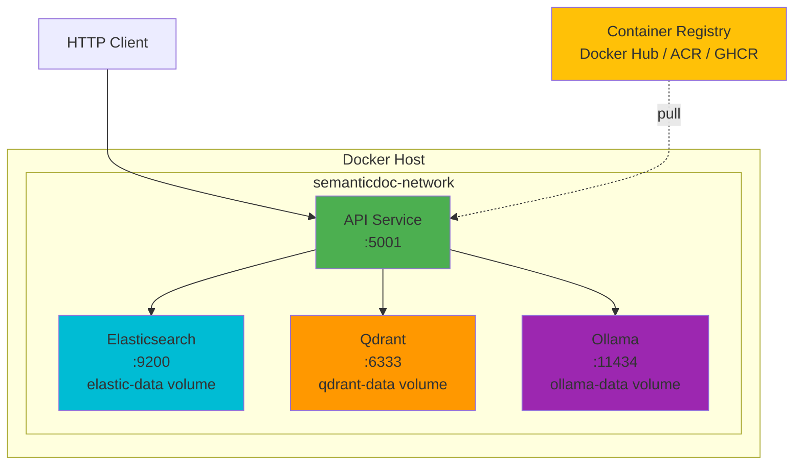

# SemanticDocIngestor

[](https://github.com/raminesfahani/SemanticDocIngestor/actions/workflows/nuget-packages.yml)
[](LICENSE)
[](https://github.com/raminesfahani/SemanticDocIngestor/search?l=c%23)

[](https://www.nuget.org/packages/SemanticDocIngestor.Core)
[](https://dotnet.microsoft.com/download/dotnet/9.0)
[](DOCKER_COMPOSE_GUIDE.md)
[](docker-compose.yml)

<p align="center">
  
</p>

<p align="center">
  <strong>A powerful .NET 9 SDK for intelligent document processing with hybrid search and RAG capabilities</strong>
</p>

<p align="center">
  Build production-ready document ingestion pipelines with vector similarity search, keyword matching, and AI-powered answers using Ollama LLMs
</p>

<p align="center">
  <a href="#-quickest-start-docker-compose-recommended">🐳 Quick Start with Docker</a> •
  <a href="#-usage-examples">📝 Usage Examples</a> •
  <a href="src/sdk/SemanticDocIngestor.Core/README.md">📖 SDK Documentation</a> •
  <a href="DOCKER_COMPOSE_GUIDE.md">🐋 Docker Guide</a>
</p>

---

## 🎯 Overview

**SemanticDocIngestor** is a comprehensive .NET 9 solution and SDK for ingesting, processing, and searching documents with state-of-the-art hybrid search capabilities. It combines vector similarity search (semantic) with traditional keyword search (BM25) to deliver optimal retrieval results for retrieval-augmented generation (RAG) applications.

### What Makes It Special?

- **🎨 SDK-First Design**: Clean, well-documented APIs with full IntelliSense support
- **🚀 .NET Aspire Ready**: First-class support for cloud-native orchestration with automatic service discovery
- **🔍 Hybrid Search**: Best-of-both-worlds combining vector embeddings and keyword matching
- **☁️ Multi-Source Support**: Ingest from local files, OneDrive, Google Drive, and more
- **🤖 AI-Powered**: Built-in RAG with Ollama for intelligent question answering
- **📊 Real-Time Progress**: Event-driven architecture with SignalR support
- **⚡ Production-Ready**: Resilient with Polly (retries, circuit breakers, timeouts)
- **🧩 Extensible**: Plugin architecture for custom processors and cloud providers

---

## 📦 Quick Start (NuGet Package)

### Installation

```bash
dotnet add package SemanticDocIngestor.Core
```

### Minimal Setup with .NET Aspire

```csharp
using SemanticDocIngestor.Core;

var builder = WebApplication.CreateBuilder(args);

// Add Aspire service defaults
builder.AddServiceDefaults();

// Add SemanticDocIngestor (auto-discovers Elasticsearch, Qdrant, Ollama)
builder.Services.AddSemanticDocIngestorCore(builder.Configuration);

var app = builder.Build();

var loggerFactory = app.Services.GetRequiredService<ILoggerFactory>();
app.UseSemanticDocIngestorCore(app.Configuration, loggerFactory);

app.MapDefaultEndpoints();
app.Run();
```

### Basic Usage

```csharp
// Inject the service
public class DocumentController(IDocumentIngestorService documentIngestor) : ControllerBase
{
    [HttpPost("ingest")]
    public async Task<IActionResult> Ingest([FromBody] List<string> filePaths)
    {
  await documentIngestor.IngestDocumentsAsync(filePaths);
        return Ok();
    }

  [HttpGet("search")]
    public async Task<IActionResult> Search([FromQuery] string query)
    {
        var response = await documentIngestor.SearchAndGetRagResponseAsync(query, limit: 5);
        return Ok(new { answer = response.Answer, sources = response.ReferencesPath.Keys });
    }
}
```

### 📖 Complete SDK Documentation

**👉 [Read the Full SDK Guide](src/sdk/SemanticDocIngestor.Core/README.md)** - Comprehensive documentation including:
- Detailed installation and configuration
- .NET Aspire integration guide
- Connection string management (Aspire and manual)
- Advanced features (multi-source ingestion, progress tracking)
- Complete API reference
- Real-world examples and deployment scenarios
- Troubleshooting and performance tips

---

## 📖 Documentation

| Document | Description |
|----------|-------------|
| **[SDK Guide](src/sdk/SemanticDocIngestor.Core/README.md)** | Complete SDK documentation with examples, API reference, and deployment guides |
| **[Docker Quick Reference](DOCKER_QUICK_REFERENCE.md)** | Quick commands and file reference for Docker deployment |
| **[Docker Compose Guide](DOCKER_COMPOSE_GUIDE.md)** | Complete guide for deploying with Docker, container registries, and production setup |
| **[Docker Deployment](DOCKER_DEPLOYMENT.md)** | Alternative Docker deployment strategies and registry push instructions |
| **[Documentation Summary](DOCUMENTATION_SUMMARY.md)** | Overview of all documentation and packaging details |
| **[Contributing Guide](CONTRIBUTING.md)** | How to contribute to the project |
| **[Support](SUPPORT.md)** | Getting help and support resources |
| **[Code of Conduct](CODE_OF_CONDUCT.md)** | Community guidelines |

---

## 🏗️ Solution Architecture

### Repository Structure

```
SemanticDocIngestor/
├── src/
│   ├── sdk/    # 📦 NuGet Packages
│   │   ├── SemanticDocIngestor.Core  # Main SDK (Published to NuGet)
│   │   │   └── README.md          # 📖 Complete SDK Documentation
│   │   ├── SemanticDocIngestor.Domain         # Domain models & abstractions
│   │   └── SemanticDocIngestor.Infrastructure # Implementations (Elastic, Qdrant, Ollama)
│   │
│   └── apps/# 🎯 Reference Applications
│       ├── SemanticDocIngestor.AppHost.AppHost        # .NET Aspire orchestration
│ ├── SemanticDocIngestor.AppHost.ApiService     # REST API service
│       ├── SemanticDocIngestor.AppHost.BlazorUI     # Interactive Blazor UI
│       └── SemanticDocIngestor.AppHost.ServiceDefaults # Aspire defaults
│
├── tests/
│   └── SemanticDocIngestor.AppHost.Tests      # Unit & integration tests
│
├── docs/            # Additional documentation
├── DOCUMENTATION_SUMMARY.md # SDK documentation checklist
├── CONTRIBUTING.md                    # Contribution guidelines
├── SUPPORT.md      # Support resources
└── CODE_OF_CONDUCT.md         # Community guidelines
```

### Core Components


```mermaid
graph TB
    A[Client Application] --> B[SemanticDocIngestor.Core SDK]
    B --> C[Document Processor]
    B --> D[Cloud Resolvers]
    B --> E[RAG Service]
    
    C --> F[Vector Store - Qdrant]
    C --> G[Keyword Store - Elasticsearch]
    
    E --> H[Ollama LLM]
 
    D --> I[OneDrive Resolver]
    D --> J[Google Drive Resolver]
    D --> K[Local File Resolver]
    
    F --> L[Semantic Search]
    G --> M[Keyword Search]
    
    L --> N[Hybrid Search Results]
    M --> N
    
    N --> E
    E --> O[AI-Generated Answer]
```

### Docker Deployment Architecture


```mermaid
graph TB
    subgraph "Docker Host"
        subgraph "semanticdoc-network"
    API[API Service<br/>:5001]
            ES[Elasticsearch<br/>:9200<br/>elastic-data volume]
QD[Qdrant<br/>:6333<br/>qdrant-data volume]
            OL[Ollama<br/>:11434<br/>ollama-data volume]
   end
    end
    
    Client[HTTP Client] --> API
    API --> ES
    API --> QD
    API --> OL
  
    Registry[Container Registry<br/>Docker Hub / ACR / GHCR] -.->|pull| API
 
    style API fill:#4CAF50
    style ES fill:#00BCD4
    style QD fill:#FF9800
    style OL fill:#9C27B0
    style Registry fill:#FFC107
```

**Docker Compose manages:**
- 🔧 Network configuration and service discovery
- 💾 Persistent volumes for data retention
- 🏥 Health checks and dependency ordering
- 🔐 Environment-based secrets management
- 🔄 Automatic container restart policies

---

## ✨ Key Features

### 📄 Document Processing Pipeline
- **Multi-Format Support**: PDF, DOCX, XLSX, PPTX, TXT, MD
- **Intelligent Chunking**: Configurable chunk sizes with context preservation
- **Metadata Extraction**: Page numbers, sections, sheet names, row indices
- **Deterministic IDs**: Prevents duplicate ingestion with stable identities
- **Batch Processing**: Efficient bulk operations with progress tracking

### 🔍 Hybrid Search Engine
- **Vector Search**: Semantic similarity using Qdrant and embedding models
- **Keyword Search**: Full-text search with Elasticsearch BM25 algorithm
- **Result Fusion**: Automatic deduplication and relevance ranking
- **Configurable Limits**: Control the number of results and context size

### ☁️ Multi-Source Ingestion
- **Local Files**: Direct file system access
- **OneDrive**: Microsoft Graph API integration with delegated auth
- **Google Drive**: Drive API v3 with OAuth 2.0 support
- **Extensible**: Plugin architecture for custom cloud providers (S3, Azure Blob, etc.)

### 🤖 Retrieval-Augmented Generation (RAG)
- **Ollama Integration**: Local LLM support (Llama 3, Mistral, Gemma, etc.)
- **Context Assembly**: Automatic context building from search results
- **Streaming Responses**: Real-time token-by-token answer generation
- **Source Attribution**: Track which documents contributed to answers

### 📊 Real-Time Progress Tracking
- **Event-Driven**: Subscribe to `OnProgress` and `OnCompleted` events
- **SignalR Support**: Real-time updates to web clients
- **Cached Progress**: Query progress at any time during ingestion
- **Detailed Metrics**: Files processed, completion percentage, current file

### ⚡ Production-Grade Resilience
- **Polly Integration**: Configurable retry policies, circuit breakers, timeouts
- **Graceful Degradation**: Continues processing on partial failures
- **Connection Pooling**: Efficient resource utilization
- **Health Checks**: Aspire-compatible health endpoints

### 🎨 Developer Experience
- **Full XML Documentation**: IntelliSense support for all public APIs
- **Clean Abstractions**: SOLID principles, dependency injection
- **Comprehensive Logging**: Structured logging with Serilog
- **OpenTelemetry Ready**: Distributed tracing and metrics
- **NuGet Package**: Simple installation and versioning

---

## 🚀 Getting Started

### Prerequisites

| Component | Version | Purpose | Optional |
|-----------|---------|---------|----------|
| .NET SDK | 9.0+ | Runtime | ❌ Required |
| Docker Desktop | Latest | Container runtime | ✅ Recommended (for Docker deployment) |
| Elasticsearch | 8.x | Keyword search | ⚠️ Required (auto-provisioned in Docker) |
| Qdrant | 1.x | Vector search | ⚠️ Required (auto-provisioned in Docker) |
| Ollama | Latest | LLM & embeddings | ⚠️ Required (auto-provisioned in Docker) |

### 🐳 Quickest Start: Docker Compose (Recommended)

**Perfect for:** Getting up and running in minutes with zero infrastructure setup

```bash
# Clone the repository
git clone https://github.com/raminesfahani/SemanticDocIngestor.git
cd SemanticDocIngestor

# Create environment configuration
cp .env.example .env
# Edit .env and set: ELASTIC_PASSWORD=your_secure_password

# Start everything (API + Elasticsearch + Qdrant + Ollama)
docker-compose up -d

# Check status
docker-compose ps

# Access the API at http://localhost:5001
# View API docs at http://localhost:5001/scalar/v1
```

That's it! All services are running and configured. Skip to [Usage Examples](#-usage-examples) to start ingesting documents.

**📖 Complete Docker guide:** [DOCKER_COMPOSE_GUIDE.md](DOCKER_COMPOSE_GUIDE.md)

---

### Option 1: Using the SDK in Your Project

**Best for:** Integrating document search into existing applications

```bash
# Install the NuGet package
dotnet add package SemanticDocIngestor.Core

# Configure and use (see SDK README for details)
```

📖 **[Complete SDK Guide](src/sdk/SemanticDocIngestor.Core/README.md)**

### Option 2: Running the Reference Application

**Best for:** Exploring features, testing, or using as-is

#### With .NET Aspire (Orchestrated Development)

```bash
# Clone the repository
git clone https://github.com/raminesfahani/SemanticDocIngestor.git
cd SemanticDocIngestor

# Restore dependencies
dotnet restore

# Run with Aspire (starts all services)
cd src/apps/SemanticDocIngestor.AppHost
dotnet run

# Access the applications
# - Aspire Dashboard: http://localhost:15888
# - API Service: http://localhost:5000
# - Blazor UI: http://localhost:5001
```

#### Without Aspire (Manual)

```bash
# Start infrastructure services first
docker-compose up -d elasticsearch qdrant ollama

# Run API service
cd src/apps/SemanticDocIngestor.AppHost.ApiService
dotnet run

# Run Blazor UI (in another terminal)
cd src/apps/SemanticDocIngestor.AppHost.BlazorUI
dotnet run