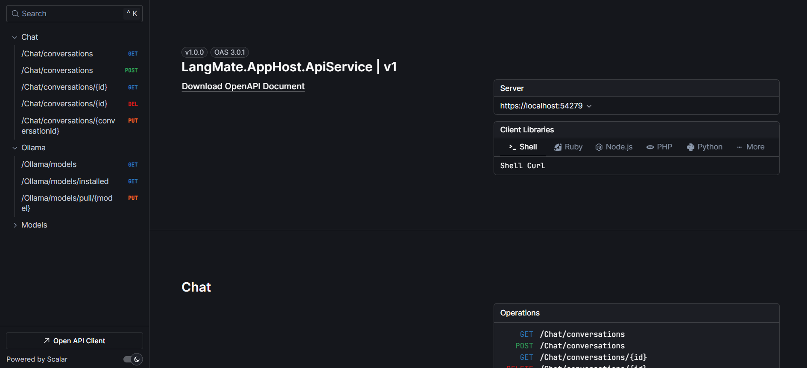

# SemanticDocIngestor

[](https://github.com/raminesfahani/SemanticDocIngestor/actions/workflows/nuget-packages.yml)
[](LICENSE)
[](https://github.com/raminesfahani/SemanticDocIngestor/search?l=c%23)

[](https://www.nuget.org/packages/SemanticDocIngestor.Core)


<br>

**SemanticDocIngestor** is a modular and extensible AI chat application and SDK platform built with .NET 9 and fully compatible with .NET Aspire.  
It provides a Blazor-powered Web UI, Ollama model integrations, persistent chat history via MongoDB, and a flexible SDK for .NET developers to integrate and use local LLMs (like Gemma, LLaMA2, Mistral) easily and securely.

---

## 🌟 Key Features

- ⚙️ **Fully compatible with .NET Aspire**
- 💬 **Chat UI** 
    - built with Blazor Server (interactive, reactive experience)
- 🧠 **Ollama Integration** 
  - LLM-based completion and conversation
- 🗃 **MongoDB Chat History and caching** 
  - for persistent and fast retrieval
- 🔧 **SemanticDocIngestor.Core SDK** 
  - use Ollama easily in your own .NET apps
- 🧩 **Pluggable Middleware** 
  - Polly-powered **Resiliency**, Circuit Breakers, and Retry logic
- 🚀 **File Upload Support** 
  - with base64 image preview support (for image input models)
- 🌐 **API Endpoints** 
  - Implemented a backend-driven project for using in every client app
- 🧰 **Developer-Friendly** architecture — clean, testable and maintainable

---

## 🧠 Architecture

```
SemanticDocIngestor/
├── Apps/
├──── SemanticDocIngestor.AppHost.AppHost        → .NET Aspire for orchestrating and deploying the apps on Docker, Kubernetes, or any other cloud platform.
├──── SemanticDocIngestor.AppHost.BlazorUI        → Blazor ChatBot UI sample project using SemanticDocIngestor SDK
├──── SemanticDocIngestor.AppHost.ApiService        → Web API sample project using SemanticDocIngestor SDK
├── SDK/
├──── SemanticDocIngestor.Core               → Reusable .NET SDK to interact with Ollama
├──── SemanticDocIngestor.Middleware         → Polly-based Resiliency Middleware (retry, timeout, circuit breaker)
├──── SemanticDocIngestor.Extensions         → Utilities, helpers and extension methods
├──── SemanticDocIngestor.Persistence        → MongoDB chat history, caching layer, repositories and configuration
```

---

## 📦 Installation

### Prerequisites
- [.NET 9 SDK](https://dotnet.microsoft.com/en-us/download/dotnet/9.0)
- [Ollama](https://ollama.com/) installed and running locally (for model inference)
- [MongoDB](https://www.mongodb.com/) (locally or cloud instance)

### Run the App

```bash
git clone https://github.com/raminesfahani/SemanticDocIngestor.git
cd SemanticDocIngestor/src/apps/SemanticDocIngestor.AppHost.AppHost

# Restore dependencies and build
dotnet restore
dotnet build

# Run the .NET Aspire Dashboard
dotnet run
```

Then open `https://localhost:17198/` in your browser to see the .NET Aspire dashboard. You can launch Blazor ChatBot or Web API apps over there by their own links.

---

# SemanticDocIngestor.Core SDK

**SemanticDocIngestor.Core** is a lightweight, extensible .NET SDK designed to make working with Ollama-powered local AI models seamless and developer-friendly. It abstracts away the complexity of managing conversations, interacting with Ollama endpoints, and persisting chat history — all while offering resiliency, caching, and extensibility.

## 📦 Installation

To use `SemanticDocIngestor.Core`, install the required NuGet package [](https://www.nuget.org/packages/SemanticDocIngestor.Core), or include the project reference in your solution.

```bash
dotnet add package SemanticDocIngestor.Core
```

## ✅ Sample Usage

You can see [Full Documentation](src/sdk/SemanticDocIngestor.Core/README.md) and sample usage in this link as well.

---

## 🧠 SemanticDocIngestor Blazor Chat UI

The **SemanticDocIngestor Blazor App** is an intelligent, real-time chat UI built with Blazor Server and integrated with the powerful local AI models provided by Ollama using ***SemanticDocIngestor.Core SDK***.

It provides a complete frontend experience for interacting with AI models, managing chat history, uploading files, and dynamically updating chat state.

### ✨ Features

- 🔁 Chat with Ollama Models: Seamlessly send and stream messages from local Ollama instances.

- 💬 Persistent Conversations: Every chat session is stored in MongoDB and can be resumed anytime.

- 📂 File Uploads: Upload image files and pass them to models like llava for multimodal interactions.

- 🧭 Sidebar Navigation: Access previous chats and start new ones from a clean sidebar UI.

- 📦 Model Switching: Easily switch between available Ollama models.

- 🔃 Streaming Responses: Uses async streaming to display tokens as they’re generated.

- ☁️ Resilient Middleware: Protected with timeout, retry, and circuit breaker policies.

- 🔔 Global Error Toasts: All unhandled exceptions surface as toast notifications.

## Screenshots

<div></div>
<br>
<div></div>
<br>
<div></div>

---

## 📡 SemanticDocIngestor WebAPI

The **SemanticDocIngestor API Service** is the backend layer of the SemanticDocIngestor system, exposing RESTful HTTP APIs for external integration, orchestration, and automation.

It serves as a stateless gateway for interacting with the SemanticDocIngestor core functionalities — such as chat sessions, file uploads, model management, and streaming chat completions — powered by the ***SemanticDocIngestor.Core SDK*** and ***Ollama***.

### ✨ Features

- 🔗 Chat Completion API: Start or continue chat sessions supporting stream mode with local Ollama models.

- 🧠 Model Discovery: Query available and pulled models from the Ollama runtime.

- 💬 Conversation APIs: Read, delete, and manage persistent chat history.

- 🖼️ File Upload: Upload image files to be used with multimodal models (e.g., gemma).

- 🔐 Middleware-Enhanced Resilience: Protected by retry, timeout, and circuit breaker policies via SemanticDocIngestor.Middleware.

- ⚙️ Scalar Integration: Auto-generated OpenAPI documentation (easily added).

<br>
<div></div>

---

## 🛠️ Build and Test

```bash
dotnet build --configuration Release
dotnet test
```

---

## 📬 Contributing

Contributions are welcome!

1. Fork the repo and create your branch
2. Implement your feature or fix
3. Submit a PR with proper context

---

## 📄 License

Licensed under the [MIT License](LICENSE).

---

## 📣 Contact

Created and maintained by [@raminesfahani](https://github.com/raminesfahani).  
For issues and features, open a [GitHub Issue](https://github.com/raminesfahani/SemanticDocIngestor/issues).

---

## 🙏 Acknowledgements

This project uses the [Ollama repository](https://github.com/tryAGI/Ollama) for local AI model integration. I am thankful to the maintainers and contributors of Ollama for making this technology available.